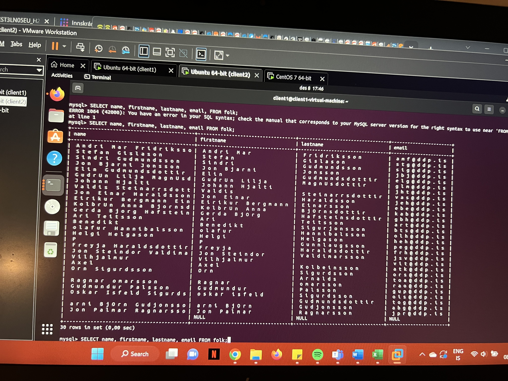
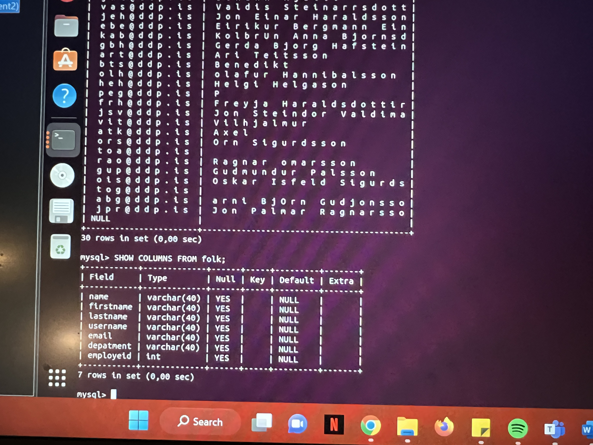
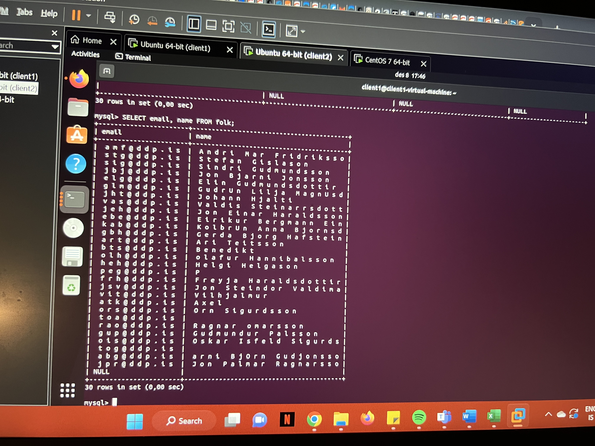
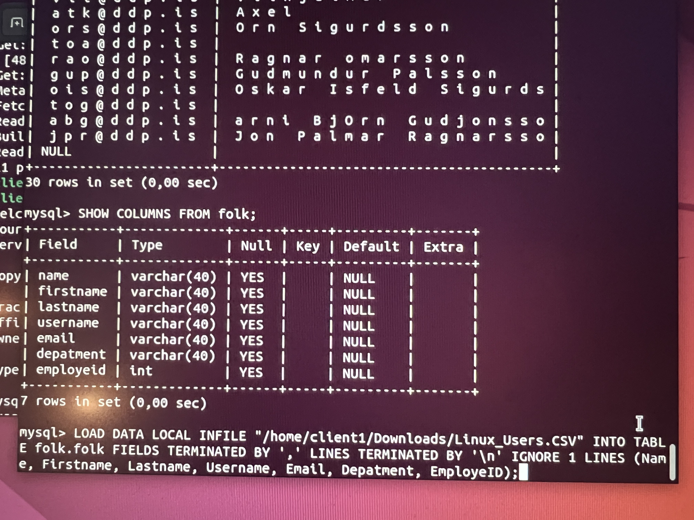
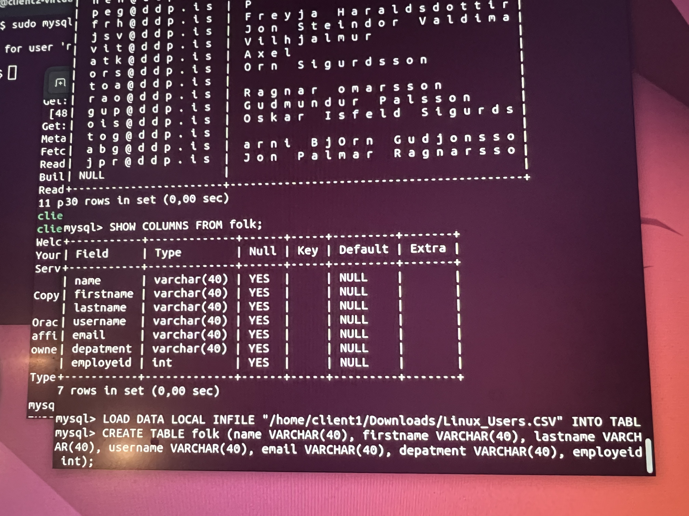
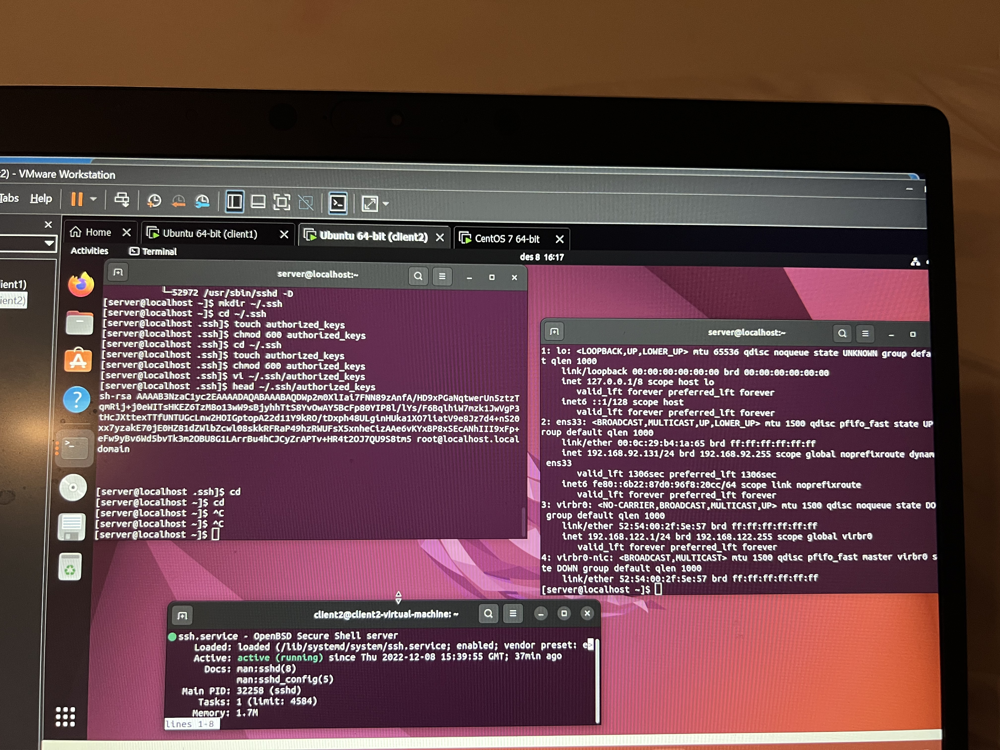

# KEST3LN Lokaverkefni
### Páll Rúnar Sigurðsson og Viktor Andri Hermannsson
---
## 1 - Hostname and domain

.png)
.png)
.png)

## 2 Static IP

.png)

## 3 - DHCP

.png)
.png)
.png)

## 4 - DNS

.png)
.png)
.png)
.png)

## 5 User account script

Could add with the given user id's (see photo below) so had to remove that part of the script

.png)
.png)
.png)

## 6 MySQL

Commands used to import values

## 7 Weekly backup

.png)
.png)

## 8 NTP server

Clients only connected to server
.png)
.png)
Client configurations
.png)
Server configurations, connected to an Icelandic NTP server with european servers as backup
.png)

## 9 Syslog server

Client configurations
.png)
Server configurations
.png)
Folders created by syslog server (the client1 and client2 folders)
.png)
File created by syslog server
.png)

## 10 Postfix

## 11 Printers

Tölvudeild printer
.png)
Rekstrardeild printer
.png)
Framkvæmdardeild printer
.png)
Framleidsludeild printer
.png)

## 12 SSH

Here all computers are being controlled by one through SSH using RSA keys

## 13 Ports

Server
.png)
Client1
.png)
Client2
.png)
